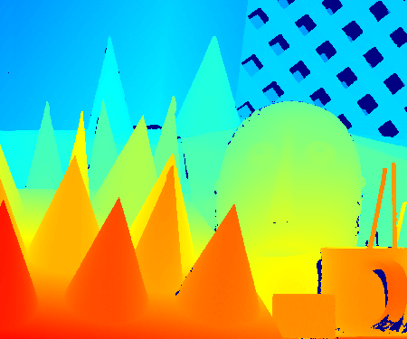

# Converts a Disparity Map from Grayscale to Color
A simple program in Matlab that converts a Disparity Map from grayscale to color.

## Input Image
The disparity map that used as input.

   

## Output Image
The colored disparity map that created at the output.

   

